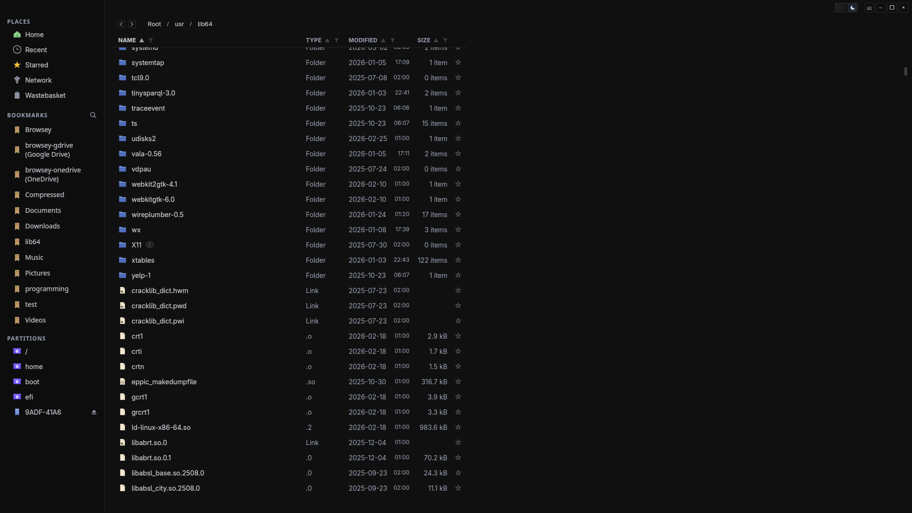
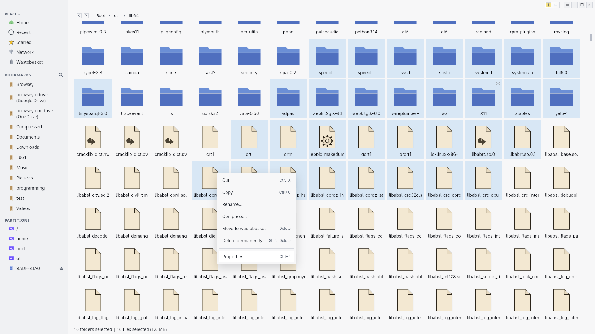

# Browsey

Browsey is a minimalist and fast, cross-platform file explorer built with Tauri 2 (Rust backend) and a Svelte/TypeScript frontend. The chrome stays light while Rust handles traversal, sorting, search, and metadata; the frontend focuses on rendering, input, and interactions.

## Status
Early beta: core flows (browse, search, clipboard, trash, compress, open with, properties) are in place; expect rapid iteration and some rough edges. Permissions editing now works on Unix (POSIX mode bits) **and** Windows (DACLs for owner/group/everyone, plus read-only/executable toggles).

## Highlights
- **Responsive lists**: Virtualized rows, smooth wheel coalescing, and cached metadata keep large folders responsive.
- **Live updates**: A `notify` watcher emits `dir-changed` events; the UI refreshes with a short debounce. Bookmarked paths are automatically allowlisted for watching (handy for mapped network drives).
- **Clipboard & conflicts**: Native copy/cut/paste commands with preview. Pasting into the same folder auto-renames without prompting; other conflicts offer overwrite vs auto-rename.
- **Search**: Recursive, case-insensitive search scoped to the current directory subtree; skips symlinks to avoid loops.
- **Drives & bookmarks**: Lists mounts/partitions (marks removable), bookmarks, starred, recent, and trash. Mounts are polled every 2s and SQLite stores bookmarks, stars, recents, and column widths.
- **Context actions**: New Folder…, Open with (associated apps + custom command), copy path, cut/copy/paste, compress to ZIP (name + level), rename, move to wastebasket (Delete), delete permanently (Shift+Delete), properties with lazy-loaded timestamps, and “open item location” for recents.
- **Drag & drop**: Internal drag/drop with custom ghost and drop-target highlighting; designed to work on Linux and Windows.
- **Thumbnails**: Lazy, virtualized thumbnail loading in grid view with caching, per-file permission checks, format allowlist, decode timeouts, and size limits; falls back to icons instantly so UI stays smooth.
- **Grid view parity**: Fixed-size cards with virtualization, keyboard navigation and range selection, lasso overlay, hidden-item dimming, and consistent click-to-clear selection; names can span up to three lines but stay aligned to show the start.
- **Theming**: Dark mode by default plus a light mode toggle in the drag bar; all colors centralized in `frontend/src/app.css`.
- **Cross-platform details**: Uses system WebView (WebKit on Linux, WebView2 on Windows). Network locations on Windows delete permanently (Explorer parity) because the recycle bin is unavailable there.
- **Removable drives**: Detects removable volumes and offers an eject action on Windows (CfgMgr/SetupAPI + IOCTL fallback) and on Linux (`gio`/`umount`/`udisksctl` with lazy fallback); safely-ejected drives are hidden from the list. Busy devices surface a short “in use” hint.
- **UI polish**: Flat, squared styling across inputs/buttons/modals; address bar shows breadcrumbs when unfocused and selects the full path on focus; renaming pre-selects the filename without its extension; browser default context menu and hotkeys are disabled (except Ctrl+Shift+I), while app shortcuts remain.
- **Visual cues for access**: Read-only items show an eye icon; items without read access show a padlock. Multi-select permission changes apply in one batch with undo/rollback on failure (Unix and Windows).

## Screenshots



## Requirements
Supported platforms: Linux and Windows (macOS is not supported yet).

Common:
- Rust (stable) via `rustup`
- Node.js LTS + npm (frontend build/dev only)

Linux build deps (Fedora names; adapt to your distro):
- `webkit2gtk4.1-devel` `javascriptcoregtk4.1-devel` `libsoup3-devel` `gtk3-devel`
- `libappindicator-gtk3` `librsvg2-devel` `patchelf` `rpm-build`

Windows:
- WebView2 Runtime (built-in on Win11; otherwise install from Microsoft)
- Visual Studio Build Tools (C++ workload) or full Visual Studio
- Rust via `rustup`, Node LTS

## Install
- Fedora/RPM: download the latest `Browsey-<version>-1.x86_64.rpm` from Releases and install with `sudo rpm -Uvh --replacepkgs Browsey-<version>-1.x86_64.rpm`.
- Windows: grab the NSIS installer from Releases and run it (bundled by `cargo tauri build --bundles nsis`).
- From source: clone, run `npm --prefix frontend install`, then `cargo tauri dev --no-dev-server` (or `cargo tauri build` for a release bundle).

## Development
1) Install system deps (above).
2) Install frontend deps:
   ```bash
   npm --prefix frontend install
   ```
3) Run dev (Vite on 5173 is started by the Tauri hook):
   ```bash
   cargo tauri dev --no-dev-server
   ```
   Convenience wrappers: `scripts/dev-server.sh` (Unix) or `scripts/dev-server.bat` (Windows).

Quick checks:
```bash
cargo check
npm --prefix frontend run check
```

## Building
Frontend only:
```bash
npm --prefix frontend run build
```

Rust release binary:
```bash
cargo build --release
```
Produces `target/release/browsey`.

Tauri bundles:
- Windows NSIS:
  ```bash
  cargo tauri build --bundles nsis
  ```
  or use `scripts/build-release.bat` (cleans old bundles, builds frontend, then bundles). Output lands in `target/release/bundle/nsis/`.
- Linux RPM (smallest on Fedora-like distros):
  ```bash
  cargo tauri build --bundles rpm
  ```
  Helper: `scripts/build-release.sh`. Output in `target/release/bundle/rpm/`.

## Keyboard & interaction map
- **Typing without focus**: Enters filter mode on the address bar; Esc exits.
- **Search**: `Ctrl+F` toggles search mode; Esc leaves search mode.
- **View toggle**: `Ctrl+G` toggles between list and grid.
- **Bookmarks**: `Ctrl+B` on a single folder opens the bookmark modal; remove via sidebar close icon.
- **Open console**: `Ctrl+T` opens a terminal at the current directory when in a folder view.
- **Selection**: `Ctrl+A` selects all. Click-drag draws a selection box (works in both list and grid). In grid view, arrow keys + Shift handle range selection; clicking blank space clears selection.
- **Clipboard**: `Ctrl+C`/`Ctrl+X` copy/cut; `Ctrl+V` paste. Pasting into the same directory auto-renames duplicates; other conflicts prompt overwrite vs auto-rename.
- **Rename**: `F2` or context menu.
- **Delete**: `Delete` moves to wastebasket (or permanently on Windows network paths); `Shift+Delete` deletes permanently with confirmation.
- **Properties**: `Ctrl+P` opens properties with lazy-loaded timestamps; folder sizes reuse the status bar computation.
- **Hidden files**: `Ctrl+H` toggles showing hidden files (hidden items are shown by default).

## Architecture notes
- **Backend (`src/`)**: Tauri commands for listing, search, mounts, bookmarks, starring, trash, rename/delete, open with (desktop entries on Linux, custom commands, and default handler), clipboard preview/execute, compression to ZIP, and a filesystem watcher. Windows-specific behaviors (e.g., network delete fallback, resilient `read_dir`) are isolated behind cfg gates.
- **Frontend (`frontend/src/`)**: Explorer UI in Svelte with virtualized rows, drag/drop hook, clipboard/context-menu helpers, selection box, toast, conflict modal, and thumbnail loader (IntersectionObserver + queue). Layout and theme live in `frontend/src/app.css`. Modals share structure and focus handling via `frontend/src/ui/ModalShell.svelte` and `frontend/src/ui/modalUtils.ts`.
- **Data & persistence**: SQLite DB in the platform data dir stores bookmarks, starred items, recents, and column widths. Thumbnail cache lives under the user cache dir with trimming (size/file caps). Capability file `capabilities/default.json` grants event listen/emit so the watcher can signal the UI.
- **Icons**: Uses a custom Browsey icon set in `frontend/public/icons/scalable/browsey/` mapped via `src/icons.rs`, covering sidebar items, folders (incl. templates, public, desktop, etc.), files (images, text, pdf, spreadsheets, presentations), compressed archives, and shortcuts. Removable disks and bookmarks also use the new set.

## Project layout
- `src/commands/` — Tauri command modules (fs, search, bookmarks, settings, meta, library).
- `src/fs_utils.rs` — Path sanitation, platform helpers, logging.
- `src/clipboard.rs` — Clipboard state, conflict preview, paste/rename/overwrite handling.
- `src/watcher.rs` — Notify-based watcher emitting `dir-changed`.
- `frontend/src/features/explorer/` — Explorer components, hooks, stores, utils, selection.
- `frontend/src/ui/` — Shared UI atoms (toasts, modals, drag ghost, etc.).
- `scripts/` — Dev/build helpers for both shells.
- `resources/` — Icons and generated schemas; `capabilities/` for Tauri permissions.

## Behavior specifics
- Listings sort folders before files and skip symlinks for safety.
- Search is scoped to the current root; empty queries return no results but preserve the listing.
- “Open item location” jumps to the parent and reselects the item.
- Windows network paths delete permanently (recycle bin is unavailable there). Symlink copy/move is rejected.
- Permissions: Owner/group/other (Everyone) access bits can be edited on Unix and Windows; Windows maps to the file DACL and honors read-only and executable toggles. Changes roll back if any target fails.
- Removable volumes on Windows expose an eject action; once a device is successfully ejected the UI removes it and filters out NOT_READY/DEVICE_NOT_CONNECTED remnants.
- Open with modal lists matching applications (fallbacks included), allows a custom command, uses the system default when chosen, and launches apps detached without console noise.
- Drag/drop uses a custom ghost image; Tauri window drag/drop is disabled to allow HTML5 DnD on Windows.
- Permissions editing is available on Unix-like systems; Windows permissions editing is planned for a future release (UI will surface capability when supported).

## Disclaimer
Browsey performs file operations (copy, move, rename, compress, trash, delete). Use it at your own risk, keep backups of important data, and verify paths before destructive actions. The software is provided as-is without warranties; contributors are not liable for data loss or other damage.

## License
MIT (see `LICENSE`).
