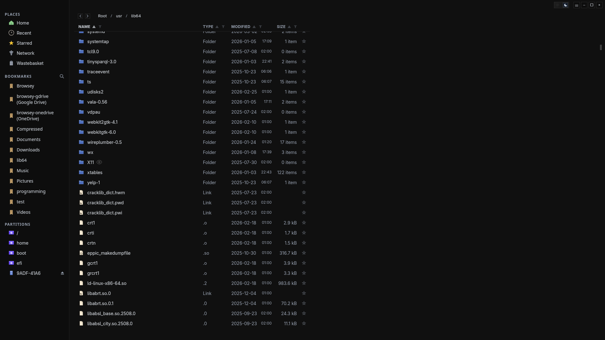
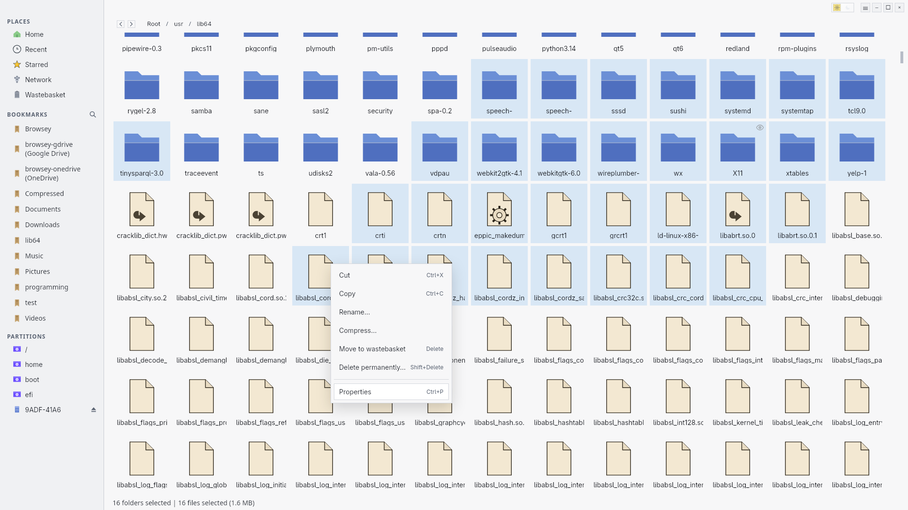

# Browsey

Browsey is a minimalist and fast, cross-platform file explorer built with Tauri 2 (Rust backend) and a Svelte/TypeScript frontend. The chrome stays light while Rust handles traversal, sorting, search, and metadata; the frontend focuses on rendering, input, and interactions. It is inspired by GNOME Nautilus, aiming for that familiar feel with a lighter, faster stack.
The project is developed with AI assistance from OpenAI Codex.

Documentation: https://chl84.github.io/Browsey/
For technical deep-dives (module maps, behavior details, and release notes), use the docs site.

## Status
Browsey `1.0.0` is production-ready for Linux on the validated Linux target surface. Core flows (browse, search, clipboard, trash, compress, duplicate checks, open with, properties, settings persistence, and supported cloud remotes) are intended to be daily-driver quality on that surface. Windows builds remain available, but the Windows version is currently in maintenance mode (critical fixes and compatibility updates) rather than active feature development. Permissions editing works on Unix (POSIX mode bits) **and** Windows (DACLs for owner/group/everyone, plus read-only/executable toggles).

## Highlights
- Virtualized list and grid views tuned for large folders.
- Live refresh from filesystem watcher events.
- Native clipboard flow with conflict preview/resolve and background transfer progress.
- Recursive search, duplicate scanning, archive extract/compress, and open-with workflows.
- Extraction guardrails with total-size and entry-count caps to prevent runaway unpack operations.
- Settings-driven shortcut remapping with conflict validation.
- Properties with editable permissions (Unix + Windows) and lazy type-specific Extra metadata.
- Image thumbnails support common raster formats plus HDR (`.hdr`) and OpenEXR (`.exr`).
- Data maintenance actions (clear thumbnail cache, cloud file cache, stars, bookmarks, recents) with confirmation and feedback.
- Cross-platform drive/mount handling, removable media eject, and optional video thumbnails via ffmpeg.
- Persisted user defaults for view/sort/interaction behavior.

## Screenshots



## Requirements
Supported platforms: Linux and Windows (macOS is not supported yet). The main release-hardening target surface is currently Linux-first: Fedora Workstation and Ubuntu LTS, with GNOME Wayland as the primary desktop/session target.
Tested environment: Fedora 43 (primary Linux validation target).

Common:
- Rust (stable) via `rustup`
- Node.js LTS + npm (frontend build/dev only)
- PDFium is bundled in `resources/pdfium-<platform>/` so no system PDF libs are needed.
- Optional for cloud remotes (OneDrive/Google Drive/Nextcloud via `rclone`): `rclone` in `PATH` (Linux v1 strategy).
- Optional for video thumbnails: `ffmpeg` in PATH (or `FFMPEG_BIN`), otherwise video files fall back to icons.
- Linux (GNOME Wayland): install `xclip` for file clipboard interoperability between Browsey instances without GNOME shell focus/dock side-effects on `Ctrl+C` / `Ctrl+V`.

Linux build deps (Fedora names; adapt to your distro):
- `webkit2gtk4.1-devel` `javascriptcoregtk4.1-devel` `libsoup3-devel` `gtk3-devel`
- `libappindicator-gtk3` `librsvg2-devel` `patchelf` `rpm-build`

Windows:
- WebView2 Runtime (built-in on Win11; otherwise install from Microsoft)
- Visual Studio Build Tools (C++ workload) or full Visual Studio
- Rust via `rustup`, Node LTS

## Install
- Fedora/RPM: download the latest `Browsey-<version>-1.x86_64.rpm` from Releases and install with `sudo rpm -Uvh --replacepkgs Browsey-<version>-1.x86_64.rpm`.
- Ubuntu/Debian (`.deb`): download the latest `browsey_<version>_amd64.deb` from Releases and install with `sudo apt install ./browsey_<version>_amd64.deb`.
- Supported Linux release path is install + upgrade. Package downgrade is not part of the Linux 1.0 supported path.
- Windows: grab the NSIS installer from Releases and run it (bundled by `cargo tauri build --bundles nsis`).
- From source: clone, run `npm --prefix frontend install`, then `cargo tauri dev --no-dev-server` (or `cargo tauri build` for a release bundle).
- Cloud features require a separately installed `rclone` binary discoverable in `PATH` (Browsey does not bundle `rclone`).

Linux upgrade path:
- Fedora/RPM: use the next release RPM with `sudo rpm -Uvh --replacepkgs Browsey-<new-version>-1.x86_64.rpm`.
- Ubuntu/Debian (`.deb`): use the next release DEB with `sudo apt install ./browsey_<new-version>_amd64.deb`.
- Ubuntu/Debian uninstall path: `sudo apt remove browsey` (or `sudo apt purge browsey` if config cleanup is explicitly desired).

## Cloud (rclone) (Linux-first)
- Browsey cloud support is `rclone`-backed. Supported Linux providers are OneDrive, Google Drive, and Nextcloud (`webdav` when recognized as Nextcloud).
- Cloud integration is opt-in and off by default in Settings > Cloud, so local browsing is not coupled to `rclone`.
- Browsey auto-detects `rclone` from the system, and also lets you set an explicit `Rclone path` in Settings > Cloud.
- Configure remotes externally with `rclone config` (no in-app cloud login/setup UI yet).
- Settings > Cloud shows in-app cloud setup status and next-step diagnostics for `rclone`.
- Supported `rclone` remotes appear in `Network`, and you can also navigate directly to `rclone://<remote>/<path>`.
- Browsey validates `rclone` on first cloud use and requires a minimum supported version.
- Interactive cloud folder loads use a short `rclone rc` read budget, then fall back quickly to CLI instead of waiting for multi-minute hangs.
- Interactive cloud folder loads are cancellable from the activity pill while a remote folder is opening.
- Cloud operations currently use manual/explicit refresh in some flows because filesystem watching is not available for `rclone://` paths.

Current cloud limitations:
- no cloud trash/recycle-bin integration (delete is permanent)
- no undo/redo for cloud operations
- no advanced rename, archive extract/compress, duplicate scan, or direct open-with for cloud files
- cloud thumbnails are opt-in (`Cloud thumbs`) and currently limited to Grid view for image/pdf/svg, with provider and file-size guardrails
- provider-specific edge cases (especially quotas/rate limits) still require normal provider-aware validation

Notes:
- Mixed local/cloud clipboard and in-app drag/drop copy/move are supported in v1.
- Browsey no longer relies on GVFS/GOA OneDrive mounts for OneDrive file operations; use an `onedrive` remote in `rclone` instead.
- Browsey runs `rclone` via argument lists (no shell strings), does not accept arbitrary user-provided `rclone` flags, and uses the user-owned default `rclone` config.
- If a cloud folder stalls or falls back repeatedly, set log level to `Debug`, inspect `browsey/logs/browsey.log`, and retry with `BROWSEY_RCLONE_RC=0` to isolate `rcd` vs CLI behavior.

For setup details, migration notes, and cloud limitations, see the docs site.

## Development
1) Install system deps (above).
2) Install frontend deps:
   ```bash
   npm --prefix frontend install
   ```
3) Run dev (Vite on 5173 is started by the Tauri hook):
   ```bash
   cargo tauri dev --no-dev-server
   ```
   Convenience wrappers: `scripts/dev/dev-server.sh` (Unix) or `scripts/dev/dev-server.bat` (Windows).

Quick checks:
```bash
cargo check
npm --prefix frontend run check
```

## Building
Frontend only:
```bash
npm --prefix frontend run build
```

Rust release binary:
```bash
cargo build --release
```
Produces `target/release/browsey`.

Tauri bundles:
- Windows NSIS:
  ```bash
  cargo tauri build --bundles nsis
  ```
  or use `scripts/build/build-release.bat` (cleans old bundles, builds frontend, then bundles). Output lands in `target/release/bundle/nsis/`.
- Linux RPM + DEB:
  ```bash
  cargo tauri build --bundles rpm,deb
  ```
  Helper: `scripts/build/build-release.sh`. Output in `target/release/bundle/rpm/` and `target/release/bundle/deb/`.
  For manual `rpmbuild`/COPR packaging (not standard release flow), use:
  `packaging/rpm/browsey.spec` and `packaging/rpm/README.md`.

## Keyboard & interaction map (defaults)
- Default bindings are remappable in Settings.
- Core defaults: `Ctrl+F` search, `Ctrl+G` view toggle, `Ctrl+A` select all, `Ctrl+C/X/V` clipboard.
- File actions: `Ctrl+R` rename, `Delete` trash, `Shift+Delete` permanent delete, `Ctrl+P` properties.
- Navigation/helpers: `Ctrl+H` hidden files, `Ctrl+B` bookmark modal, `Ctrl+T` open terminal.
- `Esc` exits search/filter contexts.

## Architecture snapshot
- `src/`: Rust/Tauri backend command layer, metadata providers, filesystem watcher, keymap, and persistence.
- `frontend/src/`: Svelte UI with explorer features, settings UI, and shared components.
- Data and cache: SQLite for app state (bookmarks/stars/recents/settings), on-disk thumbnail cache, plus undo/log directories in the user data path.
- See docs for detailed module-level architecture and flow notes.
- Repository architecture notes:
  - `ARCHITECTURE_IMPORTS.md` for import boundary rules.
  - `ARCHITECTURE_NAMING.md` for naming/placement conventions.

## Project layout
- `src/` — Rust backend.
- `frontend/` — Svelte application UI.
- `docs/` — project documents (strategy, operations, audits, TODO archive).
- `docs-site/` — standalone documentation app (Svelte/Vite, GitHub Pages).
- `packaging/` — desktop metadata and optional manual packaging assets (including RPM spec).
- `scripts/` — helper scripts grouped by area (`build/`, `dev/`, `docs/`, `install/`, `maintenance/`).
- `resources/` and `capabilities/` — bundled assets and Tauri capability files.

## Behavior notes
- Search and duplicate scans skip symlinks.
- Permissions on symlinks are not editable.
- Windows network paths use permanent delete behavior.
- Extra metadata is lazy-loaded when opening the Extra tab.
- HDR/EXR image thumbnail decoding uses a longer timeout window than standard image formats.
- Archive extraction enforces a total output cap (100 GB) and total entry cap (2,000,000 entries).
- Linux console launch uses a strict allowlist of terminal binaries/arguments (no env-injected command strings).
- Cloud remotes are `rclone`-backed and use manual refresh semantics in some flows because filesystem watching is not available for `rclone://` paths.

## Disclaimer
Browsey performs file operations (copy, move, rename, compress, trash, delete). Use it at your own risk, keep backups of important data, and verify paths before destructive actions. The software is provided as-is without warranties; contributors are not liable for data loss or other damage.

## License
MIT (see `LICENSE`).
