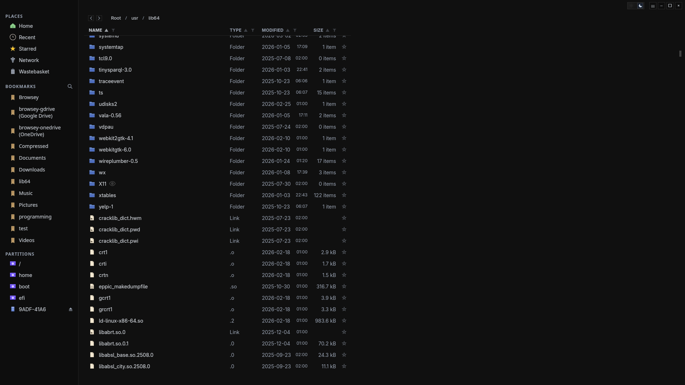
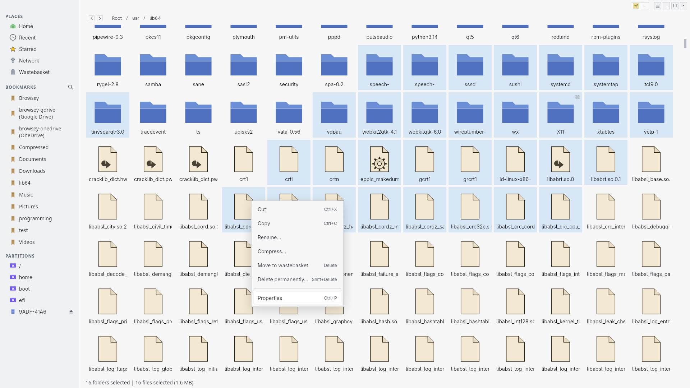

# Browsey

Browsey is a minimalist and fast, cross-platform file explorer built with Tauri 2 (Rust backend) and a Svelte/TypeScript frontend. The chrome stays light while Rust handles traversal, sorting, search, and metadata; the frontend focuses on rendering, input, and interactions. It is inspired by GNOME Nautilus, aiming for that familiar feel with a lighter, faster stack.
The project is developed with AI assistance from OpenAI Codex.

Documentation: https://chl84.github.io/Browsey/
For technical deep-dives (module maps, behavior details, and release notes), use the docs site.

Downloads: [Browsey 1.0.3](https://github.com/chl84/Browsey/releases/tag/v1.0.3).

## Status
Browsey `1.0.3` is Linux-first. This version includes safer drag-and-drop and archive operations, archive passwords, corrected default-app/folder opening, and coordinated dependency updates. Core flows include browse, search, clipboard, trash, compress, duplicate checks, open with, properties, settings persistence, and supported cloud remotes. See the [changelog](CHANGELOG.md) and [1.0.3 release notes](docs/releases/1.0.3.md) for changes and validation scope. Windows support remains in maintenance mode (critical fixes and compatibility updates); the 1.0.3 release packages target Linux x86_64. Permissions editing works on Unix (POSIX mode bits) **and** Windows (DACLs for owner/group/everyone, plus read-only/executable toggles).

## Highlights
- Virtualized list and grid views tuned for large folders.
- Ctrl + wheel zoom: list → grid at 64 / 96 / 128 / 160 / 192 px, with visible-first thumbnail loading and cache reuse.
- System/Omarchy theme colors in Settings, with light/dark fallback and a translucent lasso.
- Live refresh from filesystem watcher events.
- Native clipboard flow with conflict preview/resolve and background transfer progress.
- Recursive search, duplicate scanning, archive extract/compress, and open-with workflows. On Linux, **Open with… → select an app → check Set as default → Open** saves the desktop default for the displayed file type (all files of that MIME type, not just the selected file) and opens the file. The checkbox starts unchecked; **Open** without it remains a one-time choice. Setting a default is unavailable for directories and unknown file types.
- Extraction guardrails with total-size and entry-count caps to prevent runaway unpack operations.
- Optional AES-256 passwords when creating ZIP archives; password prompts and retries when extracting encrypted ZIP, 7z, and RAR archives. ZIP passwords encrypt file contents, not filenames.
- Settings-driven shortcut remapping with conflict validation.
- Properties with editable permissions (Unix + Windows) and lazy type-specific Extra metadata.
- Image thumbnails support common raster formats plus HDR (`.hdr`) and OpenEXR (`.exr`).
- Data maintenance actions (clear thumbnail cache, cloud file cache, stars, bookmarks, recents) with confirmation and feedback.
- Settings > Data shows read-only undo backup measurements, recovery-marker counts and manual recovery guidance. Incomplete scans are explicit; this does not add a storage quota, automatic cleanup of protected backups or persistent undo.
- Failed or cancelled local file copies may leave partial/uncertain output for inspection instead of deleting another program's edits. Original destinations are protected with recovery markers before moving into overwrite backups; failure to create/finalize protection stops the overwrite before moving the original. Blocked restoration reports the backup path and retains protection across restarts. This is manual recovery, not automatic retry, persistent undo or a power-loss guarantee.
- Local manual copies verify written-stream contents through the open output handle before accepting completion. This adds one target read pass and requires readable/seekable output; mismatches and read errors keep uncertain output and refuse fallback source deletion. Clipboard verification remains cancellable between chunks. GIO/cloud copy paths are unchanged, and verification does not lock files against later edits.
- Stop other programs writing, replacing or renaming source/destination entries during local copy, move and undo/redo. Concurrent-edit detection is not a transaction guarantee; see the [supported boundary](docs/audits/daily-driver/concurrent-writer-boundary.md).
- Cross-platform drive/mount handling, removable media eject, and optional video thumbnails via ffmpeg.
- Linux USB formatting (exFAT, FAT32, ext4, btrfs), drive properties, and on-demand MTP phone mounting without opening another file manager.
- Persisted user defaults for view/sort/interaction behavior.

## Screenshots



## Requirements
Supported platforms: Linux and Windows (macOS is not supported yet). The main release-hardening target surface is currently Linux-first: Fedora Workstation and Ubuntu LTS, with GNOME Wayland as the primary desktop/session target.
Historical baseline: Fedora 43. Recent desktop checks were run on Arch/Omarchy; see release notes for the per-release validation scope.

Common:
- Recent Rust stable via `rustup` (dependency-upgrade validation used Rust 1.98.0;
  sysinfo 0.39 requires at least 1.95)
- Node.js LTS + npm (frontend build/dev only)
- PDFium is bundled in `resources/pdfium-<platform>/` so no system PDF libs are needed.
  The pinned version is `156.0.8076.0`, with `pdfium-render 0.9.4` and the
  explicit `pdfium_7881` API profile. Provenance and checksums are in
  [`resources/pdfium.json`](resources/pdfium.json); run
  `node scripts/maintenance/check-pdfium.mjs` to verify the bundled resources.
- Optional for cloud remotes (OneDrive/Google Drive/Nextcloud via `rclone`): `rclone` in `PATH` (Linux v1 strategy).
- Optional for video thumbnails: `ffmpeg` in PATH (or `FFMPEG_BIN`), otherwise video files fall back to icons.
- Linux (GNOME Wayland): install `xclip` for file clipboard interoperability between Browsey instances without GNOME shell focus/dock side-effects on `Ctrl+C` / `Ctrl+V`.
- Linux phones: install your distribution's GVFS MTP backend (for example `gvfs-mtp` on Arch/Fedora or `gvfs-backends` on Ubuntu), unlock the phone, and enable USB file transfer.
- Linux USB formatting: UDisks2, a working PolicyKit authentication agent, and the matching tools from `exfatprogs`, `dosfstools`, `e2fsprogs`, or `btrfs-progs`. Only installed filesystem tools are offered.

Linux build deps (Fedora names; adapt to your distro):
- `webkit2gtk4.1-devel` `javascriptcoregtk4.1-devel` `libsoup3-devel` `gtk3-devel` `dbus-devel`
- `libappindicator-gtk3` `librsvg2-devel` `patchelf` `rpm-build`

For coordinated dependency updates, security checks and native-library pins,
see [Dependency maintenance](docs/maintenance/dependencies.md).

Windows:
- WebView2 Runtime (built-in on Win11; otherwise install from Microsoft)
- Visual Studio Build Tools (C++ workload) or full Visual Studio
- Rust via `rustup`, Node LTS

## Install
- Fedora/RPM: download the latest `Browsey-<version>-1.x86_64.rpm` from Releases and install with `sudo rpm -Uvh --replacepkgs Browsey-<version>-1.x86_64.rpm`.
- Ubuntu/Debian (`.deb`): download the latest `Browsey_<version>_amd64.deb` from Releases and install with `sudo apt install ./Browsey_<version>_amd64.deb`.
- Supported Linux release path is install + upgrade. Package downgrade is not part of the Linux 1.0 supported path.
- Windows: build an NSIS installer with `cargo tauri build --bundles nsis`; no new Windows installer is included in 1.0.3.
- From source: clone, run `npm --prefix frontend install`, then `cargo tauri dev --no-dev-server` (or `cargo tauri build` for a release bundle).
- Cloud features require a separately installed `rclone` binary discoverable in `PATH` (Browsey does not bundle `rclone`).

Linux upgrade path:
- Fedora/RPM: use the next release RPM with `sudo rpm -Uvh --replacepkgs Browsey-<new-version>-1.x86_64.rpm`.
- Ubuntu/Debian (`.deb`): use the next release DEB with `sudo apt install ./Browsey_<new-version>_amd64.deb`.
- Ubuntu/Debian uninstall path: `sudo apt remove browsey` (or `sudo apt purge browsey` if config cleanup is explicitly desired).

Opening a folder (1.0.3): `browsey /path/to/folder` or
`browsey 'file:///path/to/folder'` opens that folder instead of the saved start
folder. Relative paths resolve from the launch working directory. This also
supports folder launches from other applications through the default file-manager
association, such as T3 Code's Open action. With no argument, Settings > Start
folder still applies; an explicit launch does not change that setting. Only one
folder per launch is supported. Use `browsey -- -folder` for a relative folder name
starting with a dash. Invalid arguments show an error rather than silently opening
Home; missing/inaccessible folders use the existing listing error handling.

## Cloud (rclone) (Linux-first)
- Browsey cloud support is `rclone`-backed. Supported Linux providers are OneDrive, Google Drive, and Nextcloud (`webdav` when recognized as Nextcloud).
- Cloud integration is opt-in and off by default in Settings > Cloud, so local browsing is not coupled to `rclone`.
- Browsey auto-detects `rclone` from the system, and also lets you set an explicit `Rclone path` in Settings > Cloud.
- Configure remotes externally with `rclone config` (no in-app cloud login/setup UI yet).
- Settings > Cloud shows in-app cloud setup status and next-step diagnostics for `rclone`.
- Settings > Cloud also lets you run `Test connection` against a supported remote to compare Browsey's `rc` and CLI read paths.
- Supported `rclone` remotes appear in `Network`, and you can also navigate directly to `rclone://<remote>/<path>`.
- Browsey validates `rclone` on first cloud use and requires a minimum supported version.
- Interactive cloud folder loads use a short `rclone rc` read budget, then fall back quickly to CLI instead of waiting for multi-minute hangs.
- Interactive cloud folder loads are cancellable from the activity pill while a remote folder is opening.
- Cloud operations currently use manual/explicit refresh in some flows because filesystem watching is not available for `rclone://` paths.

Cloud additions on current main (Unreleased; not in the published 1.0.3 packages):

- New File, Open With and advanced rename are available in cloud folders. Batch rename preflights all targets, refuses collisions/swaps, stops on the first execution failure and reports partial completion; it is not transactional and has no cloud undo.
- Opening a cloud file creates a private, persistent working copy with its original filename. Find copies and retained operation data in **Settings > Cloud > Working copies**; they survive restart and clearing the preview cache. Close other writers before uploading. **Upload changes as new file** checks the original and saves under a unique edited name; it never overwrites the original or uploads automatically.
- Compress and Extract use protected local staging and the existing archive engine/password flow. ZIP creation uploads a new archive; extraction uploads a uniquely named folder. Originals and local staging remain on failure/cancellation. Cloud uploads of symlinks/special files are refused; inspect the retained local output instead. Downloads and staging need local disk space and are retained until manually removed.
- OneDrive and Google Drive expose **Move to cloud trash** separately from explicit deletion. Restore through the provider website; Browsey's local Wastebasket does not list cloud trash. Nextcloud trash is not exposed through the current WebDAV adapter. Permanent deletion depends on the account/server: OneDrive Personal cannot hard-delete through this API, and server retention policies may retain deleted data. See [OneDrive](https://rclone.org/onedrive/#onedrive-hard-delete) and [Google Drive](https://rclone.org/drive/#drive-use-trash).
- **Prepare external copy…** downloads selected cloud items, then offers a copy-only drag using the existing native file-drag bridge. Cloud originals are never removed by external drag.

Current cloud limitations:

- no undo/redo for cloud operations
- no cloud duplicate scan, automatic synchronization or atomic conditional overwrite; stop other writers during operations
- archive/export selections must come from one cloud folder; cloud archive detection in menus is filename-based, with actual format/password/safety validation after download
- protected copies and staging have no automatic retention or disk quota; remove them manually only after closing editors and finishing operations. The old `cloud-open` cache is intentionally left untouched because it may contain edits from earlier releases
- cloud thumbnails are opt-in (`Cloud thumbs`) and currently limited to Grid view for image/pdf/svg, with provider and file-size guardrails
- provider-specific edge cases (especially quotas/rate limits) still require normal provider-aware validation

Notes:
- Mixed local/cloud clipboard and in-app drag/drop copy/move are supported in v1.
- Browsey no longer relies on GVFS/GOA OneDrive mounts for OneDrive file operations; use an `onedrive` remote in `rclone` instead.
- Browsey runs `rclone` via argument lists (no shell strings), does not accept arbitrary user-provided `rclone` flags, and uses the user-owned default `rclone` config.
- If a cloud folder stalls or falls back repeatedly, set log level to `Debug`, inspect `browsey/logs/browsey.log`, and retry with `BROWSEY_RCLONE_RC=0` to isolate `rcd` vs CLI behavior.

For setup details, migration notes, and cloud limitations, see the docs site.

## Drag and drop (1.0.3)

- Drop onto a folder, breadcrumb, bookmark, mounted drive, or empty space in a normal directory view. Files, unmounted drives, and backgrounds in search/virtual views are not destinations. Open dialogs block drops.
- For local files, holding Ctrl/Meta at drag start locks the gesture to copy; Shift locks it to move (Ctrl/Meta wins if both are held). Otherwise internal drops use live modifiers and filesystem-aware defaults: move on the same filesystem and copy across filesystems. Cloud transfers default to copy.
- Incoming drops from another app always copy. They use the folder under the pointer, not necessarily the current directory.
- Hover over a destination for 850 ms to open it; hold near a list/grid/sidebar edge to scroll. Escape cancels the internal drag.
- Drag local files directly to another app; no Alt key is needed. Without an explicit start modifier, Browsey offers both actions and the receiver chooses its default. Hold Ctrl/Meta or Shift **before starting** to offer only copy or move. Browsey does not delete sources on drag completion. For cloud items on current main, use **Prepare external copy…** first, then drag the prepared button (copy-only). Local and cloud sources cannot be combined in one selection.
- These changes are not included in the published v1.0.2 release assets.

Native drag startup/teardown coverage and the manual acceptance checklist are in
[Native file drag regression checks](docs/testing-native-drag.md).

## Development
1) Install system deps (above).
2) Install frontend deps:
   ```bash
   npm --prefix frontend install
   ```
3) Run dev (Vite on 5173 is started by the Tauri hook):
   ```bash
   cargo tauri dev --no-dev-server
   ```
   Convenience wrappers: `scripts/dev/dev-server.sh` (Unix) or `scripts/dev/dev-server.bat` (Windows).

Quick checks:
```bash
cargo check
npm --prefix frontend run check
```

Reproducible Linux performance workloads (disposable local data, opt-in):
`bash scripts/dev/performance-workloads.sh --dry-run`, then run without
`--dry-run` on the chosen filesystem. See the
[workload and measurement guide](docs/audits/daily-driver/performance-workloads.md)
for isolation, scope and the separate native-candidate check. Ordinary tests
enforce structural bounds, not hardware-dependent timing thresholds.

## Building
Frontend only:
```bash
npm --prefix frontend run build
```

Rust release binary:
```bash
frontend/node_modules/.bin/tauri build --no-bundle
```
Produces `target/release/browsey` with the frontend bundled into Tauri. Do not
use `cargo build --release` for a distributable desktop binary: it does not set
Tauri's production build environment and may try to load the Vite development
server.

### Local installation from T3 Code (Linux x86_64)

The repository's `t3.json` declares an **Installer Browsey** action. In T3 Code,
select this project under Settings → Project → Actions and import the action
from `t3.json` once. It runs:

```bash
bash scripts/install/install-local.sh
```

The script builds the current checkout with Tauri's production frontend, checks
runtime libraries, and installs the binary and resources under
`~/.local/opt/browsey`, with a launcher at `~/.local/bin/browsey`. It keeps the
previous installation in a printed `.browsey-backup.*` directory alongside it,
preserves existing desktop integration, and does not change file associations,
commit/push, or stop running Browsey processes. Finish any active operations
before reopening Browsey. System dependencies must already be installed; missing
frontend dependencies are installed with `npm ci`.

Use `--dry-run` to inspect the plan without building or changing files. Installer
regressions can be run with `node --test scripts/install/install-local.test.mjs`.

### Tauri bundles

- Windows NSIS:
  ```bash
  cargo tauri build --bundles nsis
  ```
  or use `scripts/build/build-release.bat` (cleans old bundles, builds frontend, then bundles). Output lands in `target/release/bundle/nsis/`.
- Linux RPM + DEB:
  ```bash
  cargo tauri build --bundles rpm,deb
  ```
  Helper: `scripts/build/build-release.sh`. Output in `target/release/bundle/rpm/` and `target/release/bundle/deb/`.
  For manual `rpmbuild`/COPR packaging (not standard release flow), use:
  `packaging/rpm/browsey.spec` and `packaging/rpm/README.md`.

### Version bumps and release preparation

Use the release helper with the chosen stable version (replace `X.Y.Z` below).
The default is a read-only preview; `--apply` requires a clean working tree:

```bash
node scripts/release/bump.mjs X.Y.Z
node scripts/release/bump.mjs X.Y.Z --apply
# Optional: run strict maintenance plus docs lint/typecheck/build after applying
node scripts/release/bump.mjs X.Y.Z --apply --verify
```

Choose **one** apply command, not both. The date defaults to today in UTC;
use `--date YYYY-MM-DD` to set the planned release date explicitly.
The helper updates the app version in Cargo/lockfile, RPM and AppStream, scopes
current README/docs version references, moves changelog Unreleased entries to the
new version, and creates release notes with an unchecked validation checklist.
It preserves dependencies and historical entries; frontend/docs package versions
remain independent. Local tags and origin tags (when configured) are checked;
failed origin checks block preparation. No GitHub release/assets are modified.

Review `git diff`, curate the generated notes, and reconcile any remaining
development/unreleased labels and platform claims manually. A bump is not proof
of testing or publication. If `--verify` fails, the uncommitted bump remains for
inspection; rerun the checks after fixing it rather than applying the same version
again. Verification requires the normal development dependencies and Bash; CI
security checks and fresh manual acceptance remain separate gates.

After validation, commit/push, create an annotated `vX.Y.Z` tag on the tested
commit, and manually dispatch **Linux Release Bundles** with that tag. Inspect
the RPM/DEB packages and `SHA256SUMS`, then review and publish a draft GitHub
release. Do not overwrite old notes, tags or assets. Tagging alone does not start
the build. The helper never commits, pushes, tags, publishes, installs or updates
dependencies. Regression tests: `node --test scripts/release/bump.test.mjs`.

## Keyboard & interaction map (defaults)
- Default bindings are remappable in Settings.
- Core defaults: `Ctrl+F` search, `Ctrl+G` view toggle, `Ctrl+A` select all, `Ctrl+C/X/V` clipboard.
- File actions: `Ctrl+R` rename, `Delete` trash, `Shift+Delete` permanent delete, `Ctrl+P` properties.
- Navigation/helpers: `Ctrl+H` hidden files, `Ctrl+B` bookmark modal, `Ctrl+T` open terminal.
- `Esc` exits search/filter contexts.
- `Ctrl` + mouse wheel zooms the file view through list and five grid sizes. Zoom is per window and resets on restart; grid gaps are 8 px (Cozy) or 6 px (Compact).
- On Hyprland, the titlebar keeps Menu and Close but hides Minimize and Maximize; use the compositor's window controls instead. Other desktops retain the normal buttons. Browsey does not alter Omarchy/Hyprland settings.

## USB drives and phones

- Right-click a removable USB drive for Mount and open, Properties, or Format. Formatting erases the selected device; verify its identity and keep backups.
- New ext4/btrfs filesystems are made writable by the user performing the format. Existing volumes are not automatically repaired or re-owned.
- Formatting shows real UDisks percentages when available, otherwise indeterminate progress. If completion is uncertain, inspect the device before retrying; Browsey never automatically repeats an erase.
- MTP phones are discovered through GIO and mounted when opened. Phone Properties are informational; formatting and POSIX permission editing are not offered.
- If a phone folder reports a temporary I/O error, keep the phone unlocked, check the USB connection and file-transfer mode, and retry. MTP responsiveness depends on the phone and GVFS backend.
- GVfs/MTP fallback moves without a verifiable output ownership receipt may finish copying but refuse source deletion. Browsey retains the source and any remaining output for inspection; use Copy and verify the result instead of automatically repeating the move.

## Architecture snapshot
- `src/`: Rust/Tauri backend command layer, metadata providers, filesystem watcher, keymap, and persistence.
- `frontend/src/`: Svelte UI with explorer features, settings UI, and shared components.
- Data and cache: SQLite for app state (bookmarks/stars/recents/settings), on-disk thumbnail cache, plus undo/log directories in the user data path.
- See docs for detailed module-level architecture and flow notes.
- Repository architecture notes:
  - `ARCHITECTURE_IMPORTS.md` for import boundary rules.
  - `ARCHITECTURE_NAMING.md` for naming/placement conventions.

## Project layout
- `src/` — Rust backend.
- `frontend/` — Svelte application UI.
- `docs/` — project documents (strategy, operations, audits, TODO archive).
- `docs-site/` — standalone documentation app (Svelte/Vite, GitHub Pages).
- `packaging/` — desktop metadata and optional manual packaging assets (including RPM spec).
- `scripts/` — helper scripts grouped by area (`build/`, `dev/`, `docs/`, `install/`, `maintenance/`, `release/`).
- `resources/` and `capabilities/` — bundled assets and Tauri capability files.

## Behavior notes
- Search and duplicate scans skip symlinks.
- Permissions on symlinks are not editable.
- Windows network paths use permanent delete behavior.
- Extra metadata is lazy-loaded when opening the Extra tab.
- HDR/EXR image thumbnail decoding uses a longer timeout window than standard image formats.
- Archive extraction enforces a total output cap (100 GB) and total entry cap (2,000,000 entries).
- ZIP creation offers optional AES-256 password protection with confirmation. ZIP file names remain visible; readers must support WinZip AES. Password-protected ZIP (AES/ZipCrypto), 7z and RAR extraction prompts for a password and allows retry/cancel, including encrypted 7z/RAR file names. Batch extraction prompts separately for each protected archive.
- Archive passwords are not saved in settings, history or logs. Dialog inputs are cleared after submission/close; each archive attempt receives only its own password. See [archive tests and limitations](docs/testing-archives.md).
- Archive preflight is cancellable between entries; TAR scanning also bounds decoded bytes. Extraction checks final buffered writes and rolls back only its own still-identifiable outputs, preserving files added or replaced by other processes.
- On Unix, archive outputs start private. Extraction restores ordinary stored permission bits (including executability), never setuid/setgid/sticky bits; entries without Unix mode metadata remain private. Directory modes are restored after their contents are written.
- ZIP creation rejects devices, sockets, FIFOs, non-UTF-8 entry names, and literal backslashes in Unix entry names with an explicit error. It does not silently rewrite such names; Unicode names and literal Unix symlink targets are preserved.
- Linux console launch uses a strict allowlist of terminal binaries/arguments (no env-injected command strings).
- Cloud remotes are `rclone`-backed and use manual refresh semantics in some flows because filesystem watching is not available for `rclone://` paths.

## Disclaimer
Browsey performs file operations (copy, move, rename, compress, trash, delete). Use it at your own risk, keep backups of important data, and verify paths before destructive actions. The software is provided as-is without warranties; contributors are not liable for data loss or other damage.

## License
MIT (see `LICENSE`).
